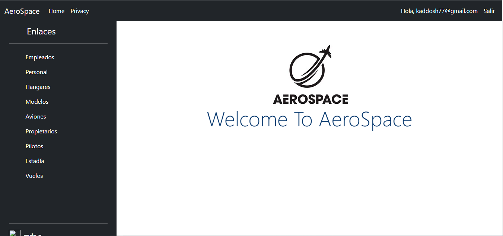
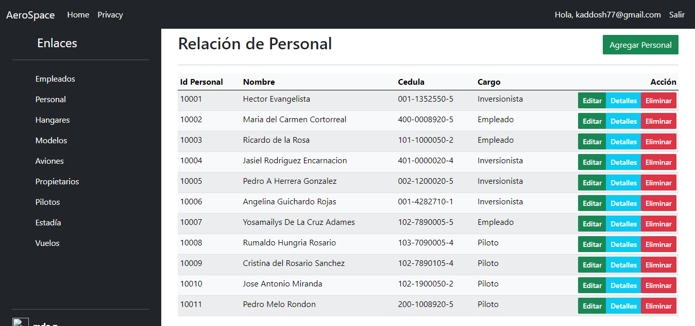
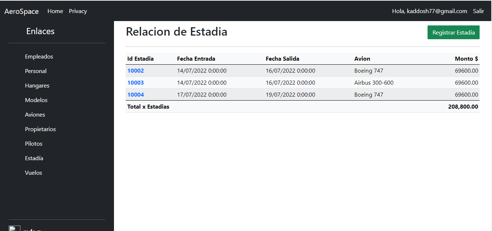
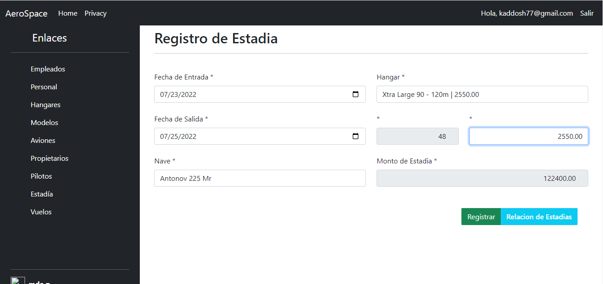

<link rel="shortcut icon" type="image/png" href="imgs/aero-space-icono.png">
<link href="https://cdn.jsdelivr.net/npm/bootstrap@5.2.0/dist/css/bootstrap.min.css" rel="stylesheet" integrity="sha384-gH2yIJqKdNHPEq0n4Mqa/HGKIhSkIHeL5AyhkYV8i59U5AR6csBvApHHNl/vI1Bx" crossorigin="anonymous">
<h1 id="main_title">  HES App n Web Developer </h1>
## AeroSpace

Un sistema donde se registran las operaciones basicas de una aerolinea.
- Registro de personal
- Registro de pasajeros
- Agenda de vuelos, etc

### Vista de Acceso

### Vista de Bienvenida

### Vista de Personal
CRUD completo en cada vista del personal involucrado en el sistema donde se puede agregar, actualizar datos del personal y un eliminado logico de registros

### Vista de Estadia de Aviones en Hangar

### Vista de Registro de Estadia de Avion en un Hangar
El formulario de registro de estadia contiene campos calculados lo que brinda una mejor experiencia del usuario (UX)

